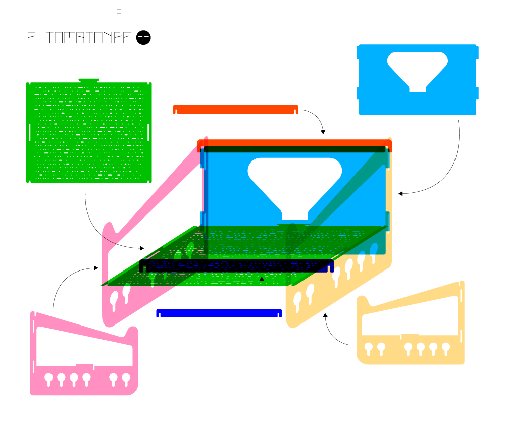

# automaton.be laptop stand

This laptop stand was designed by me, [Toon Van de Putte](https://www.automaton.be/). The stand was designed to be lasercut out of **4mm thick plate material**. The nature of the material (mdf, acrylic,...) is otherwise not very important, as long as it has sufficient strength. Corrugated cardboard is great for prototyping, but not suitable for cutting out this laptop stand, if you want to actually use it.

The small keyhole shaped slots in the sides can be used to secure cables when they are not connected to your laptop.

**No glue is required**  to assemble the pieces. They all slot together, and form a sturdy whole.

## Assembly instructions

## Finished product

The finished product in the photos was prototyped and built at [Fablab Lier](https://www.fablablier.be)