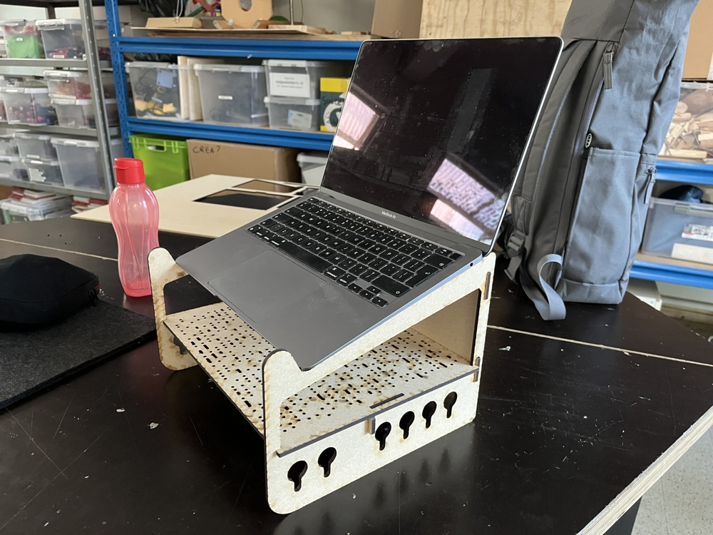

# automaton.be laptop stand

This laptop stand was designed by me, [Toon Van de Putte](https://www.automaton.be/). The stand was designed to be cut out of **4mm thick plate material**. The nature of the material (mdf, acrylic,...) is otherwise not very important, as long as it has sufficient strength. Corrugated cardboard is great for prototyping, but not suitable for cutting out this laptop stand, if you want to actually use it.

**No glue is required**  to assemble the pieces. They all slot together, and the shelf snaps to the sides.

## Assembly instructions

## Finished product

